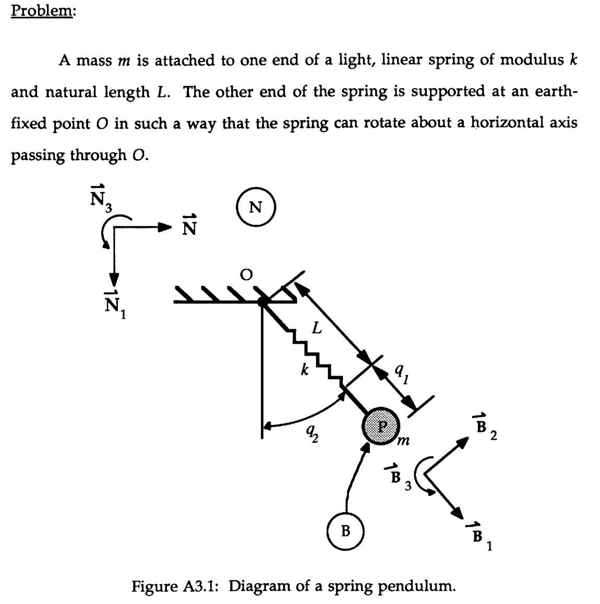

# Kane's Method for Dynamics

This page summarizes/motivates how Kane's dynamical equations of motion are derived and used. Basic understanding of vector mechanics and derivatives is assumed.

There are a few references I have used when preparing these notes, but the clearest was [this thesis](https://dspace.mit.edu/bitstream/handle/1721.1/105588/26223102-MIT.pdf?sequence=1).

## Review of Lagrange's Equations:

The steps in Lagranges equations are:

1. Let $$\bm{r}_i$$ be the location of the $$i$$-th particle in an inertial frame. Express this position as a function of a set of *generalized coordinates*:

  $$
  \bm{r}_i = \bm{r_i}(q_1, ... q_{(3N-k)})
  $$
  
  where $$N$$ is the number of particles in the system, $$3N$$ because each particle has a 3d coordinate, and $$-k$$ because there might be $$k$$ configuration constraints. So overall, we need $$3N-k$$ scalar quantities (degrees of freedom) to uniquely define the configuration of the system. 
  
2. Determine the Lagrangian:
  
  $$
  L = T - U
  $$
  
  where $$T(q_1, ... , q_{3N-k}, \dot q_1, ..., \dot q_{3N-k})$$ is the kinetic energy of the system, and $$U(q_1, ... , q_{3N-k})$$ is the potential energy of the system. 

3. Then the equations of motion are:
  
  $$
  \frac{d}{dt}\left(\frac{\partial L}{\partial \dot{q}_i}\right) - \frac{\partial L}{\partial q_i} = Q_i, \quad i=\{1, ... , 3N-k\}
  $$
  
  where 
  
  $$
  Q_i = \sum_{j=1}^{N} \bm{F}_j \cdot \frac{\partial \bm{r}_j}{\partial q_i}
  $$ 
  
  
  is the contribution of non-conservative/external forces.

Notice, we will have generated $$3N-k$$ 2nd order equations. If there are non-holonomic constraints, these are usually introduced as additional constraint equations, with lagrange multipliers. (I'll explain this better once I understand it myself).

## Derivation of Kane's method (for system of particles)

Kanes method is basically a souped-up version of Newton's 2nd law/D'Alemberts principle:

$$
\bm{R}^{P_i} - m^{P_i} \bm{a}^{P_i} = 0, \quad i = \{1, ... \nu\}
$$

where 
- $$\bm{R}^{P_i}$$ is the net force on the $$i$$-th particle
- $$m^{P_i}$$ is the mass of the $$i$$-th particle
- $$\bm{a}^{P_i}$$ is the acceleration of the $$i$$-th particle
- $$\nu$$ is the number of particles.

Now suppose the position/configuration of the system can be uniquely described by a set of $$p$$ scalar coefficients (and potentially time):

$$
\bm {r}^{P_i} = \bm{r}^{P_i}(q_1, ..., q_p, t)
$$

then the velocity in some inertial frame is

$$
\bm{v}^{P_i} = \frac{d \bm{r}^{P_i} }{dt}  = \sum_{r=1}^{p} \frac{\partial \bm{r}^{P_i}}{\partial q_r} \dot q_r  + \frac{\partial \bm{r}^{P_i}}{\partial t}
$$

Often, we can simplify this expression by choosing a convenient set of generalised speeds $$u_i$$. In Lagranges formulation, the generalised speeds $$u_r = \dot q_r$$. However, we can be more general, allowing functions of $$q, \dot q$$:

$$
u_r = u_r(q_1, ..., q_p, \dot{q}_1, ..., \dot{q}_p), \quad r = \{1, ..., p\}
$$

and we need $$p$$ generalised speeds, so that this map is invertible (to be able to find $$\dot q_i$$ in terms of $$u$$). This allows us to write 

$$
\bm{v}^{P_i}  = \sum_{r=1}^{p} \bm{v}_r^{P_i} u_r + \bm{v}_t^{P_i}
$$

where

$$
\bm{v}_r^{P_i} = \frac{\partial \bm{v}^{P_i}}{\partial u_r}, \quad \bm{v}_t^{P_i} = \frac{\partial \bm{v}^{P_i}}{\partial t}
$$

If there $$s$$ non-holonomic constraints, we rearrange the variables such that last $$s$$ generalised speeds can be represented as linear combinations of the first $$p-s$$ generalised speeds. Then, we can also write 

$$
\bm{v}^{P_i}  = \sum_{r=1}^{p-s} \tilde{\bm{v}}_r^{P_i} u_r + \tilde{\bm{v}}_t^{P_i}
$$

where

$$
\tilde{\bm{v}}_r^{P_i} = \frac{\partial \bm{v}^{P_i}}{\partial u_r}, \quad \tilde{\bm{v}}_t^{P_i} = \frac{\partial \bm{v}^{P_i}}{\partial t}
$$

where we have expressed $$\bm{v}$$ only in terms of the first $$p-s$$ generalised speeds, $$u_r$$.

Now we return to Newton's equation:

$$
\bm{R}^{P_i} - m^{P_i} \bm{a}^{P_i} = 0, \quad i = \{1, ... \nu\}
$$

and notice that if we take the dot product of this equation with $$\tilde{\bm{v}}_r$$, we get

$$
\tilde{\bm{v}}_r^{P_i} \cdot \bm{R}^{P_i} - m^{P_i} \tilde{\bm{v}}_r^{P_i} \cdot \bm{a}^{P_i} = 0, \quad i = \{1, ... \nu\}
$$

and now we can sum across all particles, giving us an equation for each generalised speed, rather than for each particle in the system!

$$
\boxed{ \underbrace{\sum_{i=1}^{\nu} \tilde{\bm{v}}_r^{P_i} \cdot \bm{R}^{P_i}}_{F_r}  + \underbrace{\sum_{i=1}^{\nu} -m^{P_i} \tilde{\bm{v}}_r^{P_i} \cdot \bm{a}^{P_i}}_{F_r^*} = 0, }\quad r = \{1, ..., p-s\}
$$

which gives $$p-s$$ equations of motion, called Kane's Dynamical Equations of Motion.

## Kane's Method for Bodies

The same general method is used, but we also need to introduce equations that describe the rotational dynamics of the system. 

If a rigid body B belongs to a non-holonomic system S with $$p$$ degrees of freedom in an inertial reference frame A, the set of all forces and torques on B can be summarised by a single resultant force $$\bm R^{B}$$ acting through a point $$Q$$ of B, and a torque $$\bm T$$ on B.  Then the generalised active force is 

$$
\tilde F_r^{B} = {}^A \tilde{\bm{\omega}}_r^{B} \cdot \bm T + \tilde{\bm{v}}_r^{Q} \cdot \bm{R}^B, \quad r=\{1, ..., p\}
$$

and the inertial forces are:

$$
\tilde {F_r^{B}}^* = {}^A \tilde{\bm{\omega}}_r^{B} \cdot \bm T^* + \tilde{\bm{v}}_r^{Q} \cdot {\bm{R}^*}^B, \quad r=\{1, ..., p\}
$$

where 

$$
\begin{align*}
{\bm{R}^*}^B &= -m^B \bm{a}^*\\
\bm T^* &= - \bm \alpha \cdot \bm I - \bm \omega \times \bm I \cdot \bm \omega  = - \sum_{i=1}^{\beta} m_i \bm r_i \times \bm a_i
\end{align*}
$$

where $$\bm a^*$$ is the acceleration of the center of mass of B in A, and if there are $$\beta$$ individual particles in B, the second version of $$T^*$$ can be used, or if the central inertia dyadic of B is known, the first version of $$T^*$$ can be used. If the principal central moments of inertia are known, and are aligned with a frame C, we can also write:

$$
\begin{align*}
\bm T^* = &- (\alpha_1 I_1 - \omega_2 \omega_3 (I_2 - I_3)) \bm c_1 \\
& - (\alpha_2 I_2 - \omega_3 \omega_1 (I_3 - I_1)) \bm c_2 \\
& - (\alpha_3 I_3 - \omega_1 \omega_2 (I_1 - I_2)) \bm c_3 
\end{align*}
$$

where $$\bm \alpha = \alpha_1 \bm c_1 + \alpha_2 \bm c_2  + \alpha_3 \bm c_3$$, and $${}^N \bm \omega^B = \omega_1 \bm c_1 + \omega_2 \bm c_2  + \omega_3 \bm c_3$$

Finally, the dynamical equations of motion are 

$$
\sum_{i=1}^{\nu} \tilde F_r^{B_i} + {\tilde F_r^{B_i}}^* = 0, \quad r=\{1, ..., p\}
$$

for each of the $$\nu$$ bodies in the system. Together with the kinematic differential equations $$\dot q_r = \dot q_r(q, u)$$, the equations of motion are complete.

-------------------------------------

## Example 1: Spring Pendulum

Consider this problem, taken from the reference above.

The position of the particle is 

$$ 
\bm r^{P_1} = (L+ q_1) \bm b_1
$$

and so the velocity in the inertial frame $$N$$ is 

$$
\bm v^{P_1} = \dot q_1 \bm b_1  + {}^N\bm{\omega}^B \times (L+q_1) \bm b_1 = \dot q_1 \bm b_1 + (L+q_1)\dot q_2 \bm b_2
$$

which motivates the definition of generalised speeds:

$$
u_1 = \dot q_1, \quad u_2 = (L+q_1) \dot q_2
$$

and so $$\bm v^{P_1} = u_1 \bm b_1 + u_2 \bm b_2$$. Thus the partial velocities are 

$$
\bm v_1^{P_1} = \bm b_1, \quad \bm v_2^{P_2} = \bm b_2
$$

and we can compute the acceleration of particle 1:

$$
\begin{align*}
\bm a^{P_1} &= \dot u_1 \bm b_1 + \dot u_2 \bm b_2 + u_1 {}^N \bm{\omega}^B \times \bm b_1 +  u_2 {}^N \bm{\omega}^B \times \bm b_2 \\
&= \dot u_1 \bm b_1 + \dot u_2 \bm b_2 + u_1  \dot q_2 \bm b_2 -  u_2 \dot q_2 \bm b_1\\
&= \dot u_1 \bm b_1 + \dot u_2 \bm b_2 + \left(\frac{u_1 u_2}{L+q_1}\right) \bm b_2 -  \left(\frac{u_2^2}{L+q_1}\right) \bm b_1\\
\therefore \bm a^{P_1} &= \bm b_1 \left( \dot u_1 - \frac{u_2^2}{L+q_1} \right)  +  \bm b_2 \left(  \dot u_2 + \frac{u_1 u_2}{L+q_1}\right)
\end{align*}
$$

Lets now find the forces on the particle:

$$
\bm{R}^{P_1} = mg \bm n_1 - k q_1 \bm b_1
$$

and so we are almost ready to write Kanes equations of motion. Lets find $$F_r$$ and then $$F_r^*$$:

$$
F_r = \sum_{i=1}^{\nu} \tilde{\bm{v}}_r^{P_i} \cdot \bm{R}^{P_i}
$$

Since we have one particle $$\nu = 1$$ and 2 generalised speeds $$r = \{ 1, 2 \}$$. So 

$$
\begin{align*}
F_1 &= \tilde{\bm{v}}_1^{P_1} \cdot \bm{R}^{P_1}\\
&= \bm b_1 \cdot (mg \bm n_1 - k q_1 \bm b_1)\\
&= mg \cos q_2 - k q_1\\
F_2 &= \tilde{\bm{v}}_2^{P_1} \cdot \bm{R}^{P_1}\\
&= \bm b_2 \cdot (mg \bm n_1 - k q_1 \bm b_1)\\
&= -mg \sin q_2
\end{align*}
$$

and

$$
F_r^* = \sum_{i=1}^{\nu} \tilde{\bm{v}}_r^{P_i} \cdot (-m^{P_i} \bm a^{P_i})
$$

so

$$
\begin{align*}
F_1^* &= \tilde{\bm{v}}_1^{P_1} \cdot (-m^{P_1} \bm a^{P_1})\\
&= \bm b_1 \cdot (-m) \left(  \bm b_1 \left( \dot u_1 - \frac{u_2^2}{L+q_1} \right) + \bm b_2 \left(  \dot u_2 + \frac{u_1 u_2}{L+q_1}\right)\right)\\
&= -m \left( \dot u_1 - \frac{u_2^2}{L+q_1} \right)\\
F_2^* &= \tilde{\bm{v}}_2^{P_1} \cdot (-m^{P_1} \bm a^{P_1})\\
&= \bm b_2 \cdot (-m) \left(  \bm b_1 \left( \dot u_1 - \frac{u_2^2}{L+q_1} \right) + \bm b_2 \left(  \dot u_2 + \frac{u_1 u_2}{L+q_1}\right)\right)\\
&= -m \left(  \dot u_2 + \frac{u_1 u_2}{L+q_1} \right)
\end{align*}
$$

and so putting it together, 

$$
\begin{align*}
F_1 + F_1^* = mg \cos q_2 - k q_1 -m \left( \dot u_1 - \frac{u_2^2}{L+q_1} \right) &= 0\\
F_2 + F_2^* = -mg \sin q_2 -m \left(  \dot u_2 + \frac{u_1 u_2}{L+q_1} \right) &= 0
\end{align*}
$$

which means that the kinematic (first two) and dynamical (last two) equations that describe this system are:

$$
\boxed{
\begin{align*}
\dot q_1 &= u_1\\
 \dot q_2 &= \frac{u_2}{L+q_1} \\
 \dot u_1   &= g \cos q_2 - (k/m) q_1 +  \frac{u_2^2}{L+q_1}\\
   \dot u_2   &= -g \sin q_2 - \frac{u_1 u_2}{L+q_1} 
\end{align*}
}
$$

## Example 2: Hinged Rods

