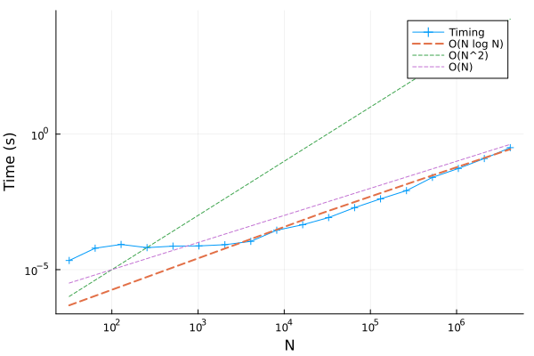

# FFTW

The fastest fourier transform in the west has almost useable documentation. Here is my summary for 1D and 2D discrete cosine transforms. 

## DCT

There are [many versions](https://en.wikipedia.org/wiki/Discrete_cosine_transform#Formal_definition) of the Direct Cosine Transform (DCT), depending on conventions and normalization. 

The main one that is widely used is the type-II DCT, and the inverse is the type-III DCT. 

In 1D, (with $$N$$ points and using 0-indexing) we have

DCT-II:

$$
Y_k = \sum_{j=0}^{N-1} X_j \cos \left ( \frac{\pi k }{N} \left (j + \frac{1}{2} \right) \right)  
$$

DCT-III (the inverse):

$$
X_k = \frac{1}{2}Y_0 + \sum_{j=1}^{N-1} Y_j \cos \left ( \frac{\pi k }{N} \left ( j + \frac{1}{2} \right) \right)
$$

Notice that both of these are linear operators. Therefore, the DCT can in general be written as 

$$
Y = P X
$$

where $$P$$ is a 'plan', i.e. a linear operator that represents the DCT. 

Based on how the normalization factors are chosen, the inverse DCT plan might just be the transpose of the DCT plan. 

## `FFTW.REDFT10` in 1D

On a 1D grid (using zero-indexing) with $$N$$ elements, it returns 

$$
Y_k = 2 \sum_{j=0}^{N-1} X_j \cos \left ( \frac{\pi k }{N} \left(j + \frac{1}{2}\right) \right)
$$

ie. 
```
Y = FFTW.r2r(X, FFTW.REDFT10)
```

To invert the signal back, run 
```
X = FFTW.r2d(Y / (2 * N), FFTW.REDFT01)
```

In julia, the code looks like

```julia
using FFTW, LinearAlgebra
 
# define my own version (VERY SLOW DO NOT USE THIS FUNCTION)
function myREDFT10_1d!(y, x)
    N = length(x)
    length(y) == N || throw(DimensionMismatch("length(y) != length(x)")
    for k=0:(N-1)
        y[k+1] = 0
        for j=0:(N-1)
            y[k+1] += 2 * x[j+1] * cos(π * (j + 1//2) * (k / N))
        end
    end
    return
end

# create test data
N = 128
X = [1 + sin(6*π * n/N) + cos(3*π * n/N) for n=1:N];

# Run FFTW
@time Y = FFTW.r2r(X, FFTW.REDFT10);
@time invY = FFTW.r2r(Y, FFTW.REDFT01) / (2 * N)
myY = zeros(N)
@time myREDFT10_1d!(myY, X)

# check results
maximum(abs.(myY - Y)) # should be 0
maximum(abs.(X - invY)) # should be 0
```

## `FFTW.REDFT10` in 2D

In 2D, `FFTW.REDFT10` returns:

$$
Y_{k_1, k_2} = 2^2 \sum_{j_1=0}^{N-1} \sum_{j_2=0}^{N-1} x_{j_1, j_2} \cos \left(\pi \left(j_1+\frac{1}{2}\right) \frac{k_1}{N} \right) \cos \left(\pi \left(j_2+\frac{1}{2}\right) \frac{k_2}{N} \right)
$$

and the inverse is such that

```
x = REDFT01( REDFT10(x) / (2*N)^2 )
```

Usage:

```julia
N = 128
M = 256
x2d = zeros(N,M)
# create a path
x0 = rand(1:N, 2)
x2d[x0...] += 1.0
for i=1:2000
    x0[1] += rand([-1,0,1])
    x0[2] += rand([-1,0,1])
    x0[1] = max(1, min(x0[1], N))
    x0[2] = max(1, min(x0[2], N))
    x2d[x0...] += 1.0
end

x2d = x2d / sum(x2d);

# do the dct
@time y2d = FFTW.r2r(x2d, FFTW.FFTW.REDFT10);

# inverse dct
@time y2di = FFTW.r2r(y2d, FFTW.FFTW.REDFT01) / (4 * prod(size(y2d)));
```

## Using Plans

FFTW also allows you to 'plan' a dct before you execute it, so as to be incredibly fast.

```julia
plan = FFTW.plan_r2r(x2d, FFTW.REDFT10)
@btime plan = FFTW.plan_r2r($x2d, $FFTW.REDFT10)
# 145.125 μs (4 allocations: 368 bytes)
``` 

To use the plan, simply run
```julia
@btime $plan * $x2d
# 504.734 μs (2 allocations: 256.05 KiB)
```

By contrast, directly calling `r2r`
```julia
@btime FFTW.r2r(x2d, FFTW.REDFT10)
# 660.477 μs (6 allocations: 256.41 KiB)
```
Notice 145 + 504 = 649 so effectively `r2r` is probably creating the plan and then running it.  

Note, the plan is only useful if you are running a dct on matrix of constant size. 

Furthermore, if you can preallocate the output, julia allows you to call `mul!` as usual:

```julia
y2d = similar(x2d)
mul!(y2d, plan, x2d)
```

After all, the FFT (or DCT) is a linear operation :)


## Scaling
Another remarkable thing: Consider a 1D DCT, on a vector of length $$N$$. The DCT will involve multiplying the vector by a square matrix of size $$N\times N$$. Normally this matrix multiplication would scale as $$\mathcal{O}(N^2)$$. However, the FFT is much faster, and scaling as $$\mathcal{O}(N \log N)$$.


