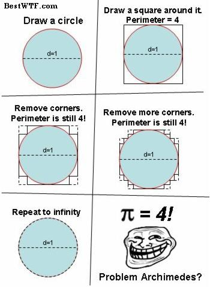

# Paradoxical Proofs

This page collects a few "theorems" that are obviously absurd, but for which a proof seemingly can be written up.
While mostly amusing, the goal is to demonstrate the ease with which one can construct "proofs" that are actually false. 
I strongly encourage you to try to find the flaw in the proof before opening the hint.

I will keep adding new fake proofs as I find them. 

## $$N=1$$ is the largest integer. 

{: .note-title }
> Theorem:
> 
> The largest integer is 1.

{: .highlight-title }
> Proof:
> 
> Let $$N$$ be the largest integer, and suppose $$N \neq 1$$, and $$N \neq 0$$. Then, $$N^2 > N$$ and therefore $$N$$ is not the largest integer. Since $$1 > 0$$, $$N=1$$ is the largest integer. 

Where's the flaw?

 
[Liberzon](https://liberzon.csl.illinois.edu/teaching/cvoc/node89.html) states it quite succinctly: 
"This argument is known as Perron's paradox. Although clearly farcical, it highlights a serious issue which we have been dodging up until now: it warns us about the danger of assuming the existence of an optimal solution. Indeed, finding the largest positive integer is an optimization problem. Of course, a solution to this problem does not exist. In the language of this book, the above reasoning correctly shows that $$N=1$$ is a necessary condition for optimality. Thus a necessary condition can be useless--even misleading--unless we know that a solution exists.

We know very well that the maximum principle only provides necessary conditions for optimality. The same is true for the Euler-Lagrange equation and several other results that we have derived along the way. We have said repeatedly that fulfillment of necessary conditions alone does not guarantee optimality. However, the basic question of whether an optimal solution even exists has not been systematically addressed yet, and it is time to do it now."

## There is only one email address. 

{: .note-title}
> Theorem:
> 
> All people have have the same email address. 

{: .highlight-title}
> Proof: 
> 
> We will prove this using induction. 
> 
> Suppose the induction claim is that any group of $$N$$ people have the same email address; we will now prove that this statement must hold true. 
> 
> Base Case: In a group of $$N=1$$ people, obviously all people have the same email address. 
>
> Induction step: Fix $$k$$. Suppose any set of $$k$$ people have the same email address by the inductive hypothesis. Consider now any set of $$k+1$$ people. Then, by the inductive hypothesis, people 1 to $$k$$ have the same email address. There is only one person left to check. But we also know that people 2 to $$k+1$$ have the same email address by the inductive hypothesis. Thus they all have the same email address. 
> 
> In this way, by induction, we know that any group of $$k$$ people must have the same email address. Since there are a (countably) finite number of people, they must all have the same email address. 

 Wheres the flaw? 

The flaw is that the induction step only holds true for $$k\geq2$$, and does not apply to $$k=1$$. Hence, although the base case is true, and the induction step is true, we cannot apply the induction step to the base case. This example highlights a common flaw in induction, where people forget to show that the induction step also holds for the base case. 

## $$\pi = 4$$

{: .note-title}
> Theorem:
> 
> Let the perimeter of a circle of diameter $$d$$ be $$C = \pi d$$. Then $$\pi = 4$$. 

{: .highlight-title}
> Proof: 
> 
> See the image below:

Wheres the flaw?

There are a few ways to look at this, but I think [this stackexchange](https://math.stackexchange.com/questions/12906/the-staircase-paradox-or-why-pi-ne4) has many explanations, that range from intuitive to analytical. 

What this gets at though is that a function of a limit might not be the same as the limit of the function. Consider this explanation from [Kurt](https://math.stackexchange.com/a/5073366/1624863):

Let's say your approximation curve is denoted as $$C_1, C_2, ...$$, where $$C_1$$ is the square, and $$C_2$$ is the cut square, and so on. Let $$P(x)$$ be the perimeter function.

The limit curve is indeed a circle:

$$
\lim_{n \to \infty} C_n = \text{Circle}.
$$

However, the limit is not always changable with $$P$$:

$$
P( \lim_{n \to \infty} C_n) \neq \lim_{n \to \infty} P(C_n).
$$

Thus, we should ask, under what circumstances the latter is equal. One of the condition is that the curves $$C_n$$ also converge to circle in their derivatives, which is not true in this case.

I would like to add that some people would argue about fact 1, that "the curve is not a circle and never will be", is an incorrect explaination.

