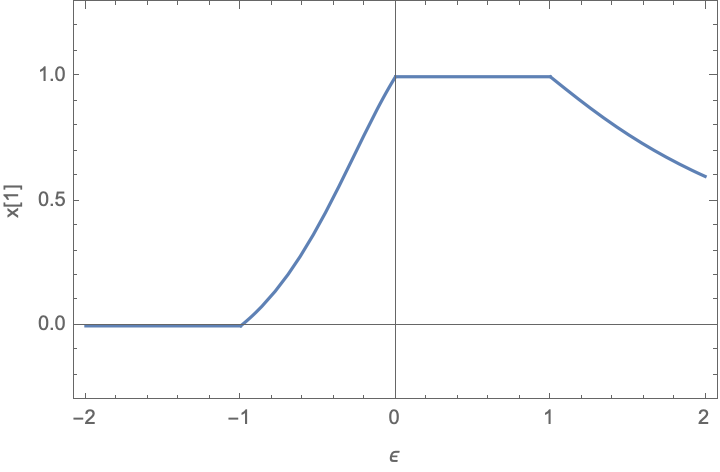
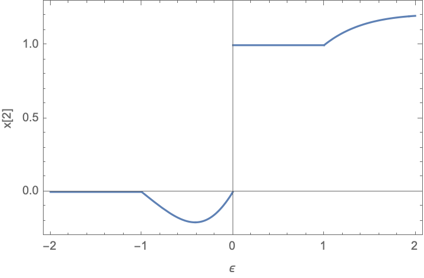
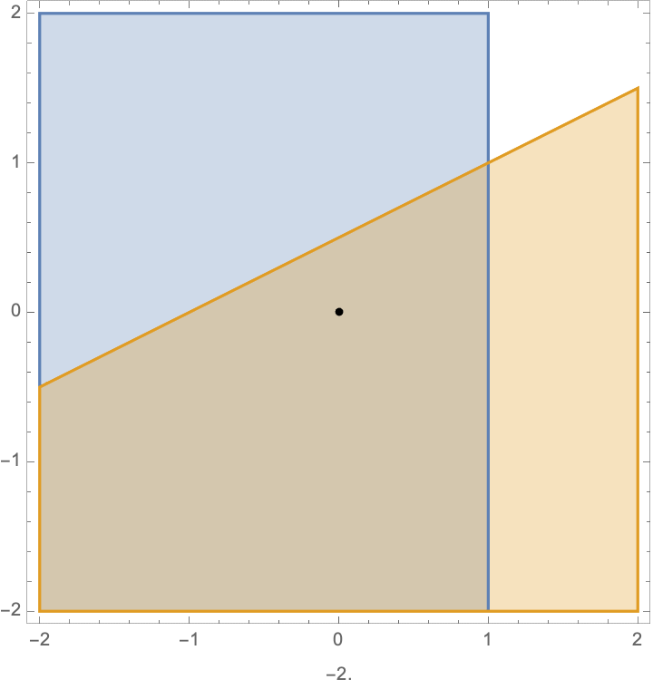

# Continuity of Parametric Quadratic Programs

Consider a QP of the form:

$$
\begin{align}
\text{minimise} \quad & x^T x\\
\text{subject to} \quad & A(\epsilon) x \leq b(\epsilon)
\end{align}
$$

where $$\epsilon \in \mathbb{R}^p$$ is a parameter, $$A, b$$ are continously differentiable functions of the parameter, $$A : \mathbb{R}^p \to \mathbb{R}^{m \times n}$$ and $$b : \mathbb{R}^p \to \mathbb{R}^{m}$$. The decision variable is $$x \in \mathbb{R}^n$$. 

Then we can say that the solution to the QP is 

$$
x^* = f(\epsilon)
$$

that is, some function of the parameter $$\epsilon$$. The question is: 

Is $$f$$ a Lipschitz continous function?

--------------------------------------

I used to think it was. And it is, if the rows of $$A$$ are linearly independent. However in the case where it is not, we can have issues. 

Here is a concrete (super simple) example, to show that $$f$$ may not even be Lipschitz. 

Consider the following QP:

$$
\begin{align}
\text{minimise} \quad & x^T x\\
\text{subject to} \quad & \begin{bmatrix}1 &  0\end{bmatrix}x  \leq 1\\
& \begin{bmatrix}1 &  \epsilon\end{bmatrix}x  \geq 1 + \epsilon
\end{align}
$$

The solution to this QP is (according to Mathematica)

$$
x^* = f(\epsilon) = \begin{cases}
[0, 0] & \text{if } \epsilon \leq -1\\
[\frac{1 + \epsilon}{1 + \epsilon^2}, \frac{\epsilon(1 + \epsilon)}{1 + \epsilon^2}] & \text{if } -1 < \epsilon \leq 0\\
[1, 1] & \text{if } 0 < \epsilon \leq 1\\
[\frac{1 + \epsilon}{1 + \epsilon^2}, \frac{\epsilon(1 + \epsilon)}{1 + \epsilon^2}] & \text{if } \epsilon > 1\\
\end{cases}
$$

and thus the solution always exists.

If we plot this solution:

**And you can see that the solution $$x_2$$ is not even continous around $$\epsilon=0$$!**

This is because around $$\epsilon=0$$, the $$A(\epsilon)$$ matrix does not have linearly independent rows. 

Pictorially, the feasible points, and the optimal solution for the QP are shown in this animation.

the number at the bottom shows the value of $$\epsilon$$. You can see the jump around $$\epsilon=0$$.

