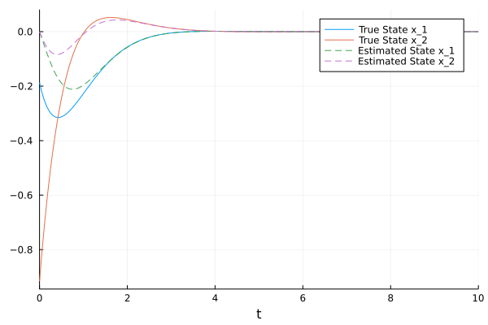
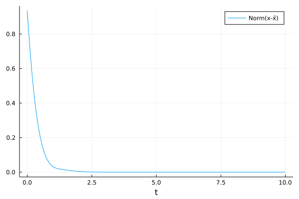
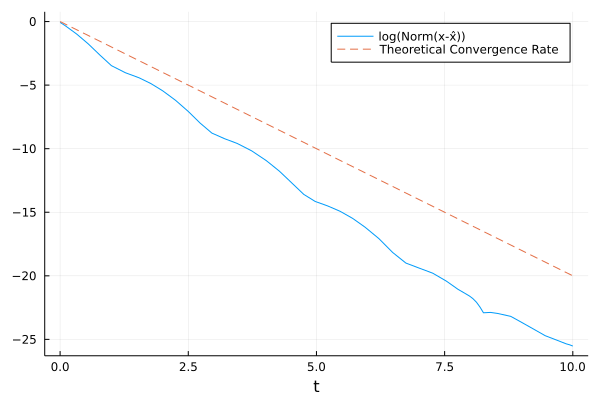

# Nonlinear Observers

This tech note summarizes the design of Nonlinear Observers, based on LMI conditions from [this seminar](https://www.youtube.com/watch?v=Ph5lMSOrXNI), by Rajesh Rajamani.

## TLDR:

For the nonlinear system

$$
\begin{align}
\dot x &= A x + f(x)\\
y &= Cx
\end{align}
$$

with state $$x$$, measurements $$y$$ and Lipschitz continuous function $$f$$ with Lipschitz constant $$\gamma$$. The estimated state is $$\hat x$$ with dynamics

$$
\begin{align}
\dot{\hat x} = A\hat x + f(\hat x) + L ( y - C \hat x)
\end{align}
$$

where $$L$$ is the observer gain matrix.

To find $$L$$, we solve the Linear Matrix Inequality (LMI):

$$
\begin{align}
\text{find} \quad & \alpha, P, R\\
\text{subject to} \quad &  \begin{bmatrix}
PA  + A^T P - RC - C^T R^T +  \gamma^2 I+ \alpha P & P \\
P & -I
\end{bmatrix} \leq 0\\
&P > 0\\
& \alpha \geq 0\\
& e_0^T P e_0 = 1
\end{align}
$$

over the variables $$\alpha, P, R$$. The observer gains are

$$L = P^{-1} R$$

This guarantees an error convergence rate of $$\alpha$$ for the Lyapunov function $$V = e^T P e$$ (ie. convergence rate of $2\alpha$ for $$\Vert e\Vert$$), where $$e = x - \hat x$$, if a solution to the optimization problem can be found.


--------------------

## Set up:

### System

We will consider nonlinear systems of the form

$$
\begin{align}
\dot x &= A x + f(x)\\
y &= Cx
\end{align}
$$

where $$x \in \mathbb{R}^n$$ is the state, and $$y \in \mathbb{R}^p$$ is the measurement. $$A, C$$ are constant real matrices, and $$f(x)$$ is a nonlinearity, which we will assume is Lipschitz continuous with constant $$\gamma$$:

$$
\left\Vert f(x) - f(y) \right \Vert \leq  \gamma \left \Vert x-y \right \Vert
$$

for all $$x, y$$.

### Observer Form

The observer will be of the form

$$
\begin{align}
\dot{\hat x} = A\hat x + f(\hat x) + L ( y - C \hat x)
\end{align}
$$

where $$\hat x$$ is the estimated state, and $$L$$ is the observer gain matrix that we need to design.

The objective is to design $$L$$ such that the error $$x - \hat x \to 0$$ as $$t \to \infty$$. 

### Observer Error Dynamics 

Let the estimation error be 

$$
\begin{align}
e = x - \hat x
\end{align}
$$

the dynamics of $$e$$ are 

$$
\begin{align}
\dot e &= \dot x - \dot{ \hat x}\\
&= \left[ A x + f(x) \right]  - \left[ A\hat x + f(\hat x) + L (C x - C \hat x) \right]\\
&= (A - LC )e + f(x) - f(\hat x)
\end{align}
$$


Notice that if the system was linear ($$f(x) = 0$$), then we are done: we just need $$A-LC$$ to be a Hurwitz matrix, and we would have proved that the error dynamics are exponentially stable. 

We introduce the basic version of designing $$L$$, and then demonstrate a few extensions. 

## Design:

Consider a Lyapunov function

$$
\begin{align}
V(e) = e^T P e
\end{align}
$$

where $$P$$ is a symmetric positive definite matrix.  The derivative of $$V$$ is

$$
\begin{align}
\dot V &= e^T P \dot e + \dot e^T P^T e\\
&= e^T (P (A-LC) + (A-LC)^T P)e + \tilde{f}^T P e + e^T P \tilde{f}
\end{align}
$$

where we used the notation $$\tilde f = f(x) - f(\hat x)$$. Now we can use the Lipschitz constant to bound $$\dot V$$:

$$
\begin{align}
\dot V &\leq e^T (P (A-LC) + (A-LC)^T P)e +  (\gamma \Vert e \Vert) \Vert P e \Vert + \Vert e^T P \Vert (\gamma \Vert e \Vert)\\
&= e^T (P (A-LC) + (A-LC)^T P)e +  2 \gamma  \Vert P e \Vert  \Vert e \Vert\\
&\leq e^T (P (A-LC) + (A-LC)^T P)e +  \gamma^2  \Vert e \Vert^2 +  \Vert P e \Vert^2\\
&= e^T \left [ P (A-LC) + (A-LC)^T P +  \gamma^2 I + P P \right] e \\
\end{align}
$$

where to go from the 2nd to 3rd step, we used the rule $$2 a b \leq a^2 + b^2$$. 

Notice that in this form, we have bounded $$\dot V$$ for the nonlinear error dynamics, in terms of the error $$e$$ and independently of $$x, \hat x$$. 

Thus, all we need to do is to ensure the matrix on the inside is negative definite:

$$
\begin{align}
\therefore [ P (A-LC) + (A-LC)^T P +  \gamma^2 I + P P ] < 0 \quad \implies e \to 0 \text{ as } t \to \infty
\end{align}
$$

We generalise this slightly, to the case where we a specific exponential convergence rate $$\alpha$$. Thus, we want $$\dot V \leq - \alpha V$$. Thus, we want 

$$
\begin{align}
[ P (A-LC) + (A-LC)^T P +  \gamma^2 I + P P ] \leq - \alpha P
\end{align}
$$

for some $$\alpha \geq 0$$. Notice that if $$\alpha = 0$$, we will know that the error dynamics are stable, not necessarily asymptotically or exponentially stable. 

The objective is now to determine $$P, L$$ such that the above holds. As we will show later, we could also let $$\alpha$$ be an decision variable, and try to find $$P$$, $$L$$ such that $$\alpha$$ is as large as possible, ie for the greatest convergence rate.

We can write this condition as a Linear Matrix Inequality (LMI). See Boyd's books on [LMIs](https://web.stanford.edu/~boyd/lmibook/) or [Convex Optimization](https://web.stanford.edu/~boyd/cvxbook/) for a explanation of LMIs. 

Unfortunately, the condition above involves products of matrices, specifically $$PL$$ and $$PP$$. We can remedy this using two tricks:

TRICK 1: Define $$R = PL$$. 

and now $$P, R$$ are the decision variable, instead of $$P, L$$. The condition is 

$$
[ PA  + A^T P - RC - C^T R^T +  \gamma^2 I + P P + \alpha P ] \leq 0
$$

and now the problem is linear in $$R$$. 

TRICK 2: Schur Complements

Using the schur complement [trick](https://en.wikipedia.org/wiki/Schur_complement#Conditions_for_positive_definiteness_and_semi-definiteness), we can write the above condition as 

$$
Q = \begin{bmatrix}
PA  + A^T P - RC - C^T R^T +  \gamma^2 I+ \alpha P & P \\
P & -I
\end{bmatrix} \leq 0
$$

which looks like a mess, but is now linear in $$P$$ and $$R$$. We define this matrix as $$Q$$ for convenience.

We can solve this LMI, using tools like `Convex.jl` and  `SCS` (open source) (see below for code):

$$
\begin{align}
\text{find} \quad & \alpha, P, R\\
\text{subject to} \quad & Q \leq 0\\
&P > 0\\
& \alpha \geq 0\\
& e_0^T P e_0 = 1
\end{align}
$$

where the last condition is used to normalise $$P$$: we require the value of $$V$$ at $$e_0 = [1, 0, ..., 0]^T$$ to be 1.

Finally, we can determine the observer gains:

$$
L = P^{-1} R
$$

which is always possible, since $$P$$ is a positive definite matrix (assuming a solution to the optimization problem was found).

## Extensions:

Refer to the seminar video for more details.

### Extension 1: Modified Lipschitz bound

We can consider a modified Lipschitz bound, of the form

$$
\Vert f(x) - f(\hat x) \Vert \leq \Vert G (x - \hat x) \Vert
$$

where $$G$$ is a constant matrix. Following the steps from above, we can re-write $$Q$$ as

$$
Q = \begin{bmatrix}
PA  + A^T P - RC - C^T R^T +  G^T G+ \alpha P & P \\
P & -I
\end{bmatrix} \leq 0
$$

which can be less conservative. Essentially, we have replaced $$\gamma^2 I$$ with $$G^T G$$. If $$G$$ is sparse, this can be a useful improvement. 

The rest of the steps are identical.


### Extension 2: Bounded Gradients

If, instead of the Lipschitz constant condition, we have

$$
K_1 \leq \frac{df}{dx} \leq K_2
$$

for some matrices $$K_1,  K_2$$, we can show that (by the mean value theorem)

$$
(\tilde f - K_1 e )^T (\tilde f - K_2 e) \leq 0
$$

then we can rewrite $$Q$$:

$$
Q = \begin{bmatrix}
PA  + A^T P - RC - C^T R^T + \alpha P & P \\
P & -I
\end{bmatrix}  + \frac{1}{2} \begin{bmatrix} M & N^T\\ N & 0 \end{bmatrix} \leq 0
$$

where

$$
M = -( K_1^T K_2 + K_2^T K_1) , \quad N =  K_1 + K_2
$$

The rest of the design process is the same as before.


### Extension 3: Disturbance Rejection

Suppose the system also receives some disturbance $$w(t)$$:

$$
\begin{align}
\dot x &= A x + f(x) + B w\\
y &= Cx
\end{align}
$$

For a $$\mathcal{H}_\infty$$ disturbance rejection requirement $$\mu > 0$$:

$$
\int_0^\infty e^T e dt \leq \mu \int_0^\infty  w^T w dt
$$

we modify $$Q$$ to

$$
Q = \begin{bmatrix}

PA  + A^T P - RC - C^T R^T +  G^TG + \alpha P & P & PB \\
P & -I & 0\\
B^T P & 0 & - \mu I
\end{bmatrix} 
\leq 0
$$

The rest of the design process is the same as before.

### Extension 4: Bilinear Optimization

Suppose we wish to make $$\alpha$$ as large as possible. We can do this, by performing a bi-linear optimization. We solve the optimization 

$$
\begin{align}
\text{maximise} \quad & \alpha\\
\text{subject to} \quad &  Q \leq 0\\
&P > 0\\
& \alpha \geq 0\\
& e_0^T P e_0 = 1
\end{align}
$$

first by fixing $$\alpha$$ freeing $P$, and then by fixing $P$ and freeing $$\alpha$$.

Doing this maintains the linearity, and allows $$\alpha$$ to grow. 

Alternatively, one could do a simple line search to see which $$\alpha$$ is the largest that can be reached. Be careful of numerical issues when $$\alpha$$ gets large though!

--------------------------------------

## Example:

Consider the nonlinear system

$$
\begin{align}
\dot x_1 &= x_2 - \sin x_1\\
\dot x_2 &= - x_1 - 2 x_2\\
y & = x_1
\end{align}
$$

In standard form we have

$$
\begin{align}
\begin{bmatrix} \dot x_1 \\ \dot x_2\end{bmatrix}
&= \begin{bmatrix} 0 & 1\\
-1 & -2
\end{bmatrix}x
+ \begin{bmatrix}
\sin x_1\\
0
\end{bmatrix}\\
y &= \begin{bmatrix} 1 & 0 \end{bmatrix} x
\end{align}
$$

Thus, the Lipschitz-type bound is 

$$
\begin{align}
\Vert f(x_1) - f(x_2) \Vert &\leq \Vert G (x_1 - x_2) \Vert\\
\left \Vert \begin{bmatrix}
\sin x_{1, 1}\\
0
\end{bmatrix}
- \begin{bmatrix}
\sin x_{1, 2}\\
0
\end{bmatrix}
\right \Vert &\leq 
\left \Vert
\begin{bmatrix}
1 & 0 \\ 0 & 0
\end{bmatrix}
\begin{bmatrix}
x_{1,1} - x_{1, 2}\\ x_{2,1 } - x_{2,2}
\end{bmatrix}
\right \Vert
\end{align}
$$

The code below solves the optimization problem:


```julia

using Convex, SCS, LinearAlgebra

A = [0 1; 
    -1 -2.]

f(x) = [-sin(x[1]), 0.0]

C = zeros(1,2)
C[1] = 1.0

G = [1 0;
     0 0.0]

nx = 2 # number of states
np = 1 # number of observations

α = 1.0

P = Variable((nx, nx))
R = Variable((nx, np))

Q = [(P*A + A'*P - R*C - C'*R' + G'*G + α*P) P ; P -diagm(ones(nx))]

constraints = [
    P == P',
    eigmax(Q) <= 0.0
    eigmin(P) >= 0.0,
    P[1,1] == 1.0
];

prob = satisfy(constraints)

solve!(prob, SCS.Optimizer)

@show P.value

@show R.value

L = inv(P.value) * (R.value)

@show L

```

This gave the result

$$
P = \begin{bmatrix}
0.9999   & -0.0030\\
 -0.0030  & 0.3146
 \end{bmatrix}
$$

$$
R = \begin{bmatrix}
 2.40541\\
 0.69388
\end{bmatrix}
$$

and thus, the observer gains are

$$
L = \begin{bmatrix}
 2.41216\\
 2.22836
\end{bmatrix}
$$


We can also simulate this behaviour

```julia

using DifferentialEquations, Plots

function closedLoop(state, params, time)
    
    x = state[1:2]
    x̂ = state[3:4]

    # make a measurement
    y = C * x
    
    # propagate true state
    dx = A * x + f(x)

    # propagate estimated state
    dx̂ = A * x̂ + f(x̂) + L * (y - C * x̂)
  
    return vcat(dx, dx̂)
end

# define an random initial condition for the true state
# define (0,0) as the initial estimated state

x0 = [randn(2)..., 0, 0.]

# simulate for 10 seconds
tspan = (0, 10.)

# construct and solve the ODE problem
odeProb = ODEProblem(closedLoop, x0, tspan)
sol = solve(odeProb)

## Plots


plot(sol, vars=(0,1), label="True State x_1")
plot!(sol, vars=(0,2), label="True State x_2")
plot!(sol, vars=(0,3), linestyle=:dash, label="Estimated State x_1")
plot!(sol, vars=(0,4), linestyle=:dash, label="Estimated State x_2")
savefig("states.png")
plot!()


plot(t-> norm(sol(t)[1:2] - sol(t)[3:4]), tspan..., label="Norm(x-x̂)", xlabel="t")
savefig("norm_error.png")
plot!()

plot(t-> log(norm(sol(t)[1:2] - sol(t)[3:4])), tspan..., label="log(Norm(x-x̂))", xlabel="t")
plot!(t-> -2*α*t, tspan..., linestyle=:dash, label="Theoretical Convergence Rate")
savefig("log_norm_error.png")
plot!()

```

The plots are below







which shows that the estimation error converges to 0, slightly faster than expected.